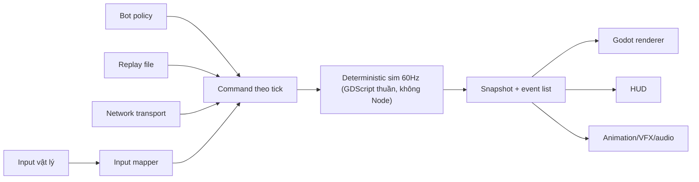

# ROADMAP FINAL — 2D Knockback Platform Fighter (Godot · Web demo → Steam Windows)

> **Nguồn sự thật duy nhất**, hợp nhất 2026-07-15 từ `roadmap-claude.md` (cấu trúc, vision, số khởi điểm) + `roadmap-codex.md` (an toàn kỹ thuật, timeline, scope) sau cross-review hai chiều. Hai file nguồn đóng băng làm tham chiếu.
> Solo dev (backend/devops) · Mentor = assistant (spec, kiến trúc, review, số liệu) · ~10 giờ/tuần.

---

## 0. One-page vision

**Định nghĩa game:** Platform fighter 2D dùng súng, không có HP truyền thống. Đạn làm tăng **instability** và gây knockback; văng khỏi blast zone là mất 1 stock (3 stocks). Kỹ năng lõi: movement, aim, recoil, đọc hướng bắn, phục hồi về sàn đấu.

**Bản sắc riêng (candidate, phải qua playtest):** mỗi phát bắn tạo **recoil lên người bắn** — vừa giới hạn spam tự nhiên, vừa là movement tech trên không, vừa biến aim thành quyết định vị trí. Chỉ giữ nếu người chơi tự hiểu sau tối đa 3 trận.

**Ranh giới IP:** quy ước thể loại (knockback, ring-out, stocks, one-way platform, hitstun) dùng thoải mái. Tên, nhân vật, art, map layout, move-list, số liệu của game cụ thể: cấm sao chép. Character design bắt buộc qua skill `original-pvp-character-design`, xuất `character-spec.json` hoàn chỉnh.

**Đích phát hành (Windows-first — thu hẹp so với bản cũ):**

| Đích | Vai trò | Khi nào |
|---|---|---|
| Web desktop (Chrome/Firefox) | Playtest/demo, gửi link là chơi | Closed demo sau fighter đầu tiên |
| **Steam Windows (native export)** | **Sản phẩm chính** | Steam Playtest khi có 2 fighter |
| Linux / macOS | Chỉ sau khi Windows ổn định + có nhu cầu thật | Sau Steam Playtest |

**Định nghĩa thành công của phiên bản đầu:** hai người vào trận dưới 1 phút; movement + hit feedback khiến họ muốn rematch; hiểu ring-out/stock không cần tutorial dài; Web và Windows chạy cùng gameplay data; replay tất định, private online không desync trong test target; 2 fighter original có counterplay rõ; pipeline tạo được fighter thứ 3 mà không viết lại engine.

**Bài học Stardew Valley:** làm đều và giữ scope trong nhiều năm — không phải cố nhồi mọi hệ thống vào một năm. Placeholder lâu hơn mức thoải mái. Polish là hàng trăm vòng chỉnh nhỏ.

---

## 1. Quyết định khóa cứng

### 1.1 Engine (Gate A — đã đóng)

- **Godot 4.x stable + GDScript (typed) + Compatibility renderer** (WebGL2, parity web/desktop).
- Khóa MỘT version cụ thể, ghi vào `DECISIONS.md`; chỉ nâng ở đầu milestone.
- GDScript vì Godot 4 chưa export C# lên Web — web demo là yêu cầu thật. Server/relay sau này dùng ngôn ngữ bạn giỏi (Go/TS), không cần cùng ngôn ngữ client.
- Simulation cố định 60 tick/giây. Controller-first, keyboard là phương án phụ.
- **Điều kiện đảo ngược có time-box:** chỉ mở lại nếu Milestone 0 (1–2 tuần) không export được target bắt buộc hoặc có blocker bằng chứng cụ thể. Qua M0 → đóng vĩnh viễn.

### 1.2 Kiến trúc bất biến: sim thuần tách engine



- Sim là class GDScript thuần (`RefCounted`), dữ liệu phẳng, không kế thừa `Node`.
- **Cấm trong sim:** `move_and_slide`, `RigidBody2D`, `Area2D`/`RayCast2D` cho hit, `Tween`/`AnimationPlayer` ảnh hưởng gameplay, signal engine làm nguồn sự thật. (Engine physics chỉ được dùng làm debug/gizmo tham khảo.)
- Bot, người chơi local, replay, remote player: **cùng một loại command**. Command không chứa position/kết quả hit.
- Renderer/VFX được phép trễ hoặc bỏ frame mà không đổi kết quả trận; tắt toàn bộ VFX không đổi final hash.
- Animation contract: sim biết `state + frame + events`; event (`spawn`, `hit`, `ko`, `invuln_on/off`…) chạy đúng 1 lần ở tick xác định; renderer chỉ chọn sprite theo state/frame, không phát gameplay event riêng.

### 1.3 Tám luật determinism (bản integer — sửa lỗi quan trọng nhất của bản cũ)

1. 60 tick/s, đếm tick bằng int; không delta time biến thiên trong sim.
2. **State authoritative là SỐ NGUYÊN** — integer sub-pixel: `1 px = 1000 sim units`. Position, velocity, knockback, instability, weight đều int. Float chỉ sống ở renderer/camera/interpolation, không bao giờ là nguồn sự thật.
3. Chỉ `+ − ×` và **chia nguyên có chủ ý** (GDScript `int/int` → int, bật warning để mọi phép chia là quyết định). **Không sqrt** — so khoảng cách bằng bình phương. **Không trig** — aim lượng tử hóa 8 hướng qua bảng vector nguyên (×1000: `(1000,0)`, `(707,-707)`…).
4. Không `randf`/`randi` global — nếu mechanic thật sự cần random: xorshift32 (int) sống trong snapshot. Không random thì không PRNG.
5. Không `Time.*`/wall clock trong sim. Mọi input qua command queue có tick.
6. Replay lưu: game version, protocol version, seed, stage id, character ids, input stream. Snapshot serialize theo canonical field order; hash (FNV-1a) mỗi 30 tick.
7. Duyệt entity theo `Array` thứ tự cố định, entity id ổn định; thứ tự resolve collision cố định.
8. Snapshot/restore một tick phải cho kết quả y hệt chạy liền mạch (nền của rollback).

### 1.4 Phương pháp làm việc

- **Chu kỳ milestone:** viết mục tiêu + acceptance criteria → thay đổi nhỏ nhất tạo bản chơi được → implement bằng placeholder → automated test cho sim → chơi bằng controller ≥3 session → clip 30–60s → playtest note (vui đâu, khó hiểu đâu, sửa gì) → chỉ mở milestone kế khi gate đạt.
- **Nhịp tuần (10h):** 3 buổi code 90–120', 1 buổi playtest/tuning, 30' cập nhật decision log + backlog. Mỗi 2 tuần một build chạy được, dù xấu.
- **Backlog 3 danh sách:** Now (5–8 task của milestone hiện tại) · Next (sau gate) · Later (mọi ý tưởng hấp dẫn — nhân vật, stage, cosmetics, ranked). Không implement thẳng từ Later.
- **Phân vai:** bạn gõ và hiểu game core; mentor spec/review/gỡ kẹt (kẹt >2h thì hỏi). Không dùng số giờ đã bỏ ra làm lý do giữ mechanic không vui. Không bỏ fun gate vì đã trót viết nhiều code.
- Sau mỗi milestone chốt 4 câu: xong gì · test thế nào · rủi ro còn lại · cần quyết gì.

---

## 2. Lộ trình 11 milestone

Forecast, không phải deadline — **gate quyết định đi tiếp, không phải lịch**. Checkpoint thực tế @10h/tuần (đã gồm buffer học):

| Checkpoint | Thời điểm thực tế |
|---|---|
| Local playable vui (sau M2–M3) | 3–6 tháng |
| Closed Web demo đẹp (sau M7) | 8–12 tháng |
| Private rollback online (sau M8) | 12–20 tháng |
| **Steam Playtest với 2 fighter (M10)** | **18–30 tháng** |

| # | Milestone | Thời lượng | Cổng ra (gate) |
|---|---|---:|---|
| 0 | Godot bootstrap | 1–2 tuần | Web + Windows export chạy, controller nhận, `sim.step()` thuần + 1 test determinism xanh, CI headless |
| 1 | Movement Lab | 3–5 tuần | Hình hộp điều khiển bằng gamepad 10 phút vẫn vui; test coyote/buffer/replay xanh |
| 2 | Knockback Lab | 4–6 tuần | **Fun-gate:** mirror match tạo rematch tự nhiên; chốt Gate B (fixed vs instability) bằng playtest note |
| 3 | Game-feel slice | 2–4 tuần | Người xem clip không cần giải thích vẫn nhận ra lúc trúng đạn; tắt VFX không đổi hash |
| 4 | Replay & determinism | 2–4 tuần | Golden replay + soak test hàng chục nghìn trận headless không lệch hash; snapshot/restore chuẩn |
| 5 | Art pipeline proof | **time-box 2 tuần** | Chỉ idle/run/shoot; quá tải → fallback ladder (Gate C) |
| 6 | First production fighter | 4–8 tuần | Atlas hoàn chỉnh + character-spec + animation viewer + silhouette QA |
| 7 | Closed Web demo | 2–3 tuần | 10–20 tester ngoài; trả lời được: movement vui? hit rõ? muốn rematch? |
| 8 | Private rollback online | 8–14 tuần | Không desync qua soak + playtest ở 0/40/80/120/150ms, jitter 0–30ms |
| 9 | Second fighter | 6–10 tuần | Hai fighter thắng bằng quyết định khác nhau; pipeline đo được thời gian thật |
| 10 | Steam Playtest (Windows) | 4–8 tuần | Build cài qua Steam Playtest branch, full controller navigation, crash/log pipeline |

Ghi chú thứ tự: M5–M6 (art) đứng trước Web demo để demo có bộ mặt — nhưng **nếu M6 kéo dài, được phép đưa closed web demo bằng placeholder lên trước**; đừng để art chặn feedback. Delay-based lockstep được dùng làm bước chẩn đoán trong M8, không phải trải nghiệm online công bố chính thức nếu còn stall.

### Nội dung chính từng milestone (chi tiết viết thành spec riêng khi tới nơi)

- **M0:** project + `DECISIONS.md` (engine version, các quyết định bất biến); export preset Web + Windows; Boot scene; input map 2 controller + keyboard fallback; sim skeleton (`sim_clock`, `sim_world`, `snapshot`, `input_command`, `state_hasher`); test: cùng input script 2 lần → cùng hash từng tick; CI: parse GDScript (warnings-as-errors nếu hợp lý) + headless test + export artifact. **Không làm combat.**
- **M1:** ground accel/friction, air control + cap, variable jump, double jump, coyote, buffer, fast-fall, one-way platform + drop-through, blast-zone visualization, debug HUD + tuning panel lưu preset. Số khởi điểm §3.2.
- **M2:** mirror match hình hộp; aim 8 hướng; 1 projectile có travel time rõ (swept collision); fire startup/active/recovery/cooldown; recoil bật/tắt bằng flag; **A/B bắt buộc** Mode A fixed knockback vs Mode B instability (§3.3); hitstun/launch; stock/respawn/spawn-protection đúng tick; bot cực đơn giản qua command interface; 3 playtest session người thật.
- **M3:** muzzle flash, trail, hit flash, launch trail theo cường độ, camera impulse có giới hạn, hit-pause nhỏ deterministic (input vẫn buffer trong pause), SFX placeholder theo cường độ, rumble abstraction, accessibility toggle (shake/flash/rumble).
- **M4:** replay recorder/player, canonical serializer, golden replay suite, seeded-bot soak (CI qua đêm — sở trường devops), replay inspector tối thiểu (tick + commands + hash + first divergent tick).
- **M5:** visual bible 1 trang + turnaround duyệt → Blender model/rig (được phép thuê/mua một lần) → 3 clip idle/run/shoot render orthographic. Time-box cứng 2 tuần.
- **M6:** đủ animation budget (§3.5), transparent frames → atlas 2048², `character-spec.json`, atlas validator, in-game animation debug viewer, silhouette QA ở resolution gameplay, đo web memory/load. Kolt redesign được làm fighter đầu — moveset squad-tactics cũ không mang sang nguyên trạng.
- **M7:** local 2P + training bot + remap cơ bản, 1 fighter 1 stage, build version hiển thị, feedback form; không thêm content theo request đơn lẻ — gom pattern.
- **M8:** transport interface tách rollback session; Web + native cùng dùng WebSocket relay (chỉ room/forward input); input prediction, snapshot ring buffer, restore → re-simulate; visual smoothing không đổi sim; protocol/version handshake; desync report = replay + first divergent hash; network simulator (latency/jitter/loss).
- **M9:** fighter 2 bằng skill (1 role chính + ≥1 weakness rõ); dùng chung rig topology nếu được; matchup test 2 chiều; người chơi mô tả được weakness của mỗi fighter sau vài trận.
- **M10:** Windows native export, Steamworks adapter sau platform-service interface, overlay + Steam Input kiểm chứng, full controller navigation, crash/error log có build id, save/config migration, depot upload script, private Playtest branch. Steam Deck test qua Proton. Linux/macOS: sau.

**Trần scope bản đầu (Gate E):** 2 fighter · 1 arena tốt · local + bot + private online · training mode. 4 fighter / 2 arena là trần dài hạn — muốn vượt phải có decision record nêu dữ liệu, chi phí, và phần bị cắt để đổi.

---

## 3. Spec kỹ thuật cốt lõi

### 3.1 Đơn vị & toán integer

- `1 px = 1000 units`; capsule fighter ~`48_000 × 96_000` units. Renderer chia `1000.0` khi vẽ, nội suy float thoải mái.
- Chia nguyên: dùng có chủ ý (`@warning_ignore("integer_division")` từng chỗ) — mọi phép chia trong sim là một quyết định.
- Khoảng cách: so sánh bình phương (`dx*dx + dy*dy <= r*r`), không magnitude.
- Aim: bảng 8 vector nguyên ×1000; projectile velocity = `speed * dir / 1000` (chia nguyên).

### 3.2 Movement — số khởi điểm (units/tick, units/tick² @60Hz)

| Thông số | Giá trị | Thông số | Giá trị |
|---|---:|---|---:|
| RUN_ACCEL | 500 | GRAVITY | 340 |
| RUN_MAX | 4 200 | MAX_FALL | 7 000 |
| FRICTION (đất, không giữ hướng) | 450 | FAST_FALL | 9 500 |
| AIR_ACCEL | 250 | JUMP_VEL | −8 000 |
| AIR_MAX | 3 400 | SHORT_HOP_VEL | −5 200 |
| COYOTE_TICKS | 5 | DOUBLE_JUMP_VEL | −7 000 |
| JUMP_BUFFER_TICKS | 5 | LAND_LAG_TICKS | 4 |

Đây là điểm xuất phát để tune bằng debug panel + controller; bộ số cuối lưu thành preset và ghi vào spec milestone.

### 3.3 Combat hypothesis v0 (toàn bộ integer)

```
# Mode B (instability):
knockback        = base_impulse + instability * growth
instability_next = clamp(instability + weapon_build, 0, 180)
# weight là phần trăm nguyên 85–115:
knockback_final  = knockback * 100 / weight_pct
hitstun_ticks    = clamp(6 + knockback_final * 3 / 1000, 6, 45)
tumble khi knockback_final > 6_000
```

Số khởi điểm: `base_impulse 2_500` · `growth 25` (≈ +8 instability/viên → mỗi viên thêm ~200 kb) · `weapon_build 8` · decay instability `1 unit mỗi 5 tick` (=12/s) chỉ sau 120 tick không trúng đạn · reset instability khi mất stock · respawn invuln 90 tick nhấp nháy rõ · recoil 800–2 500 units/tick ngược hướng bắn.

**Hit-pause (đã sửa — bản cũ 4–12 tick quá nặng, ≈67–200ms làm game súng bị giật):** light 1–2 · medium 2–3 · strong launch 3–5 tick. Chỉ tăng khi có bằng chứng playtest.

**A/B bắt buộc ở M2 (Gate B):** Mode A fixed knockback (vị trí quyết định ring-out) vs Mode B instability (trận leo thang). Chọn bằng playtest note với 5 câu hỏi: người chơi hiểu vì sao văng? trận có lê thê? người thua có cửa hồi? hit đầu trận còn nghĩa? người chơi có chủ động đổi vị trí theo instability? — không chọn bằng cảm giác của mentor.

### 3.4 Điều khiển (MVP)

Move trái/phải · Jump (double jump, variable height) · Aim 8 hướng · Shoot · Drop-through (giữ ↓ + jump) · Fast-fall. **Không có dodge/parry/ledge-grab/DI trong MVP** — movement + recoil là phòng thủ; chỉ thiết kế thêm cơ chế phòng thủ original nếu fun-gate cho thấy thiếu cửa thoát khi bị dồn góc. Không hệ combo nhiều nút. Không touch control cho tới sau production gate.

### 3.5 Art pipeline (Gate C)

**Hướng chính: 3D-to-2D pre-render** (giữ chất lượng mascot mềm như Kolt): concept → turnaround duyệt → Blender model/rig → animation clips → orthographic render PNG trong suốt → atlas 2048² → SpriteFrames + metadata → QA. AI image generation chỉ dùng cho concept/material variants/pose reference/marketing — **không** làm production frames trực tiếp (mặt/trang phục/tỷ lệ sẽ lệch giữa các frame).

**Proof trước khi cam kết (M5, time-box 2 tuần, chỉ idle/run/shoot).** Quá tải → fallback theo thứ tự: 2D skeletal/cutout → hand-drawn ít frame → pixel art có style guide. Không đổi style sau khi xong 2 nhân vật.

Quy cách: 256×256/frame, hướng phải + mirror trái (thiết kế an toàn khi lật), pivot chân giữa thống nhất roster, safe padding 12–16px. Budget fighter đầu (~57 frame — vượt 64 phải giải trình):

| State | Frame | Event | State | Frame | Event |
|---|---:|---|---|---:|---|
| idle | 6 | — | shoot | 6 | `spawn` 1 frame xác định |
| run | 8 | footstep = audio/VFX | reload | 6 | `ammo_refill` |
| jump_start | 3 | takeoff do sim | hurt | 3 | — |
| rise / fall | 2+2 | — | launch | 4 | — |
| land | 3 | recovery_end | tumble | 6 | loop |
| | | | ko | 8 | `stock_lost` do sim |

### 3.6 Cấu trúc project

```
dogfighter/
├── project.godot · export_presets.cfg · DECISIONS.md
├── game/
│   ├── core/            # sim_clock, sim_world, sim_snapshot, input_command,
│   │                    # fixed_math, state_hasher, replay   ← GDScript thuần
│   ├── fighters/        # fighter_state, movement_system, combat_system
│   ├── world/           # collision_world, projectile_system, match_system
│   ├── presentation/    # match_view, fighter_view, camera/effects/audio director
│   ├── input/           # local_input_source, bot_input_source, replay_input_source
│   ├── networking/      # transport, websocket_transport, rollback_session, protocol
│   └── ui/
├── scenes/  (labs/ match/ stages/ ui/)
├── data/    (characters/ weapons/ stages/)   # character-spec.json = nguồn sự thật design
├── assets/  (characters/ effects/ stages/ audio/ ui/)
├── tests/   (unit/ replay/ soak/)
├── tools/   (atlas/ validation/ replay_inspector/)
├── server/  (relay/)
└── archive/ # prototype TS/Canvas v1 — chỉ tham chiếu, không phát triển
```

Không tạo hết folder ngày đầu — tạo theo milestone, giữ đúng ranh giới.

### 3.7 CI/CD & quality gates

- **Mỗi push:** parse GDScript · headless unit tests · character-spec validation · atlas metadata validation · golden replay smoke.
- **Mỗi merge main:** Web + Windows debug export, artifact có commit hash.
- **Mỗi milestone tag:** release exports · full replay suite · soak test · changelog · playtest form.
- Test ưu tiên (quan trọng hơn % coverage): tick boundary, buffer/coyote biên, collision tốc độ cao, projectile hit đúng 1 lần, stock trừ đúng 1 lần, interrupt trước/sau event, snapshot/restore, same-replay-same-hash. Không đặt coverage giả cho renderer/VFX.

### 3.8 Performance budget ban đầu

Sim: tick thường càng nhỏ càng tốt, chừa dư địa lớn cho rollback resim; không allocation nóng theo tick; pool projectile/effect. Render: 60fps trên laptop thấp làm test target; particle có cap; VFX có quality toggle. Web: theo dõi download size + thời gian vào trận mỗi milestone; test Chrome/Firefox desktop (Safari chỉ khi có thiết bị/thời gian).

---

## 4. Nguồn học theo milestone

1. Godot docs "Your first 2D game" + GDScript — M0 (quen editor; kiến trúc theo roadmap này, không theo tutorial).
2. Gaffer On Games "Fix Your Timestep!" — M0–M1.
3. GMTK "Platformer Toolkit" — M1 (cảm giác nhảy).
4. Vlambeer "The Art of Screenshake" — M3.
5. infil `words.infil.net/w02-netcode` + GGPO — M8 (đọc khi tới, đừng đọc sớm).
6. GUT/gdUnit4 — M0 · GodotSteam + Steamworks docs + Remote Play docs — M10.

Tài liệu chính thức khi mâu thuẫn với roadmap về khả năng engine/platform: docs.godotengine.org (export/web/2D animation), partner.steamgames.com (SDK, Remote Play) — kiểm tra docs trước khi implement.

## 5. Risk register

| Rủi ro | Dấu hiệu sớm | Đối sách |
|---|---|---|
| Movement không vui | Tuning mãi không muốn cầm controller | Giữ placeholder, playtest thường xuyên, không thêm content |
| Tự xây quá nhiều "engine" | Nhiều tuần làm tool trước playable build | Godot lo presentation/tooling; custom code CHỈ cho authoritative sim |
| Art mất kiểm soát | 1 nhân vật nhiều tháng chưa đủ state | Proof 3 animation time-box 2 tuần; shared rig; contractor một lần |
| AI sprite không nhất quán | Mặt/trang phục/pivot đổi giữa frame | AI chỉ concept; production render từ rig |
| Rollback desync | Replay lệch hash; snapshot/restore sai | Gate M4 trước network; integer canonical state |
| Online cảm giác tệ | Stall/teleport ở 80–120ms | Prediction/rollback + network simulator; không public sớm |
| Scope creep | Viết roster/map trước fun-gate | Trần scope + decision record + backlog Later |
| Burnout | Nhiều tuần không build/clip | Milestone nhỏ, 1 ngày nghỉ/tuần, cắt scope chứ không tăng giờ |
| Steam integration muộn | Native build/gamepad lỗi sát release | Export smoke test từ M0; Playtest branch riêng ở M10 |
| Mobile làm loãng | UI touch chiếm thời gian trước core | Desktop trước; mobile sau production gate |

## 6. Steam checklist (M10 — Windows-first)

- [ ] Steamworks account + $100 app fee
- [ ] Windows native export qua CI + steamcmd depot upload
- [ ] Steam Input / controller compatibility kiểm chứng + full controller navigation
- [ ] Overlay test · crash/log có build id · save/config migration
- [ ] **Remote Play Together** = streaming từ host cho local MP (host cài, khách nhận stream) — tiện ích bổ sung, **không** thay thế rollback, **không** có web cross-play
- [ ] Steam Deck test qua Proton
- [ ] Store page: capsule, 5 screenshot, trailer 30–60s từ gameplay thật (Gate F: chỉ khi có clip thật, không concept-only)
- [ ] Private Steam Playtest branch · cân nhắc Next Fest khi demo ổn
- [ ] Linux/macOS: chỉ sau khi Windows ổn định

## 7. Trạng thái repo & việc tiếp theo

Hiện tại: prototype TS/Canvas v1 + toàn bộ design cũ đã vào `archive/` (đúng — chỉ còn giá trị tham chiếu: art Kolt, animation contract, test style). Chưa có Godot project. `docs/roadmap-claude.md` + `docs/roadmap-codex.md` đóng băng làm nguồn; **file này là roadmap điều hành duy nhất**.

Tuần này, theo thứ tự:

1. Mentor viết `design/specs/milestone-00-bootstrap.md` (spec + acceptance criteria chi tiết cho M0).
2. Cài Godot 4.x stable, ghi version vào `DECISIONS.md`, tạo production project cạnh `archive/` (không xóa archive).
3. Boot scene + export preset Web & Windows → chạy thử cả hai + xác nhận 2 gamepad trên native và Web.
4. Sim skeleton + test determinism đầu tiên + CI headless.
5. Tag `foundation-v0` khi toàn bộ acceptance criteria M0 đạt. **Chưa viết Movement Lab trước lúc đó.**
