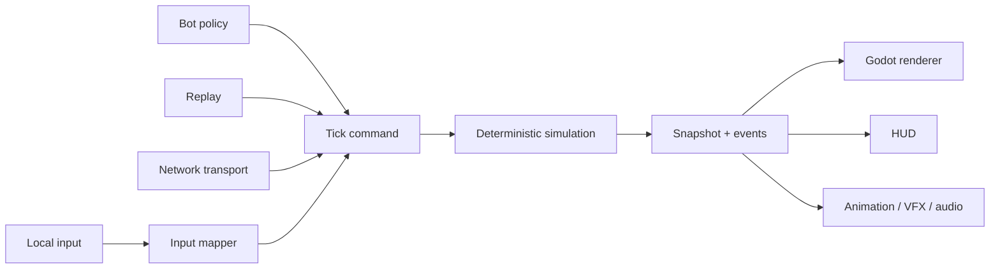

# DOGFIGHTER — Canonical Solo-Developer Roadmap

> Phiên bản hợp nhất Codex + Claude · 2026-07-15  
> Trạng thái: **đề xuất làm roadmap canonical của dự án**  
> Đối tượng: solo developer có nền backend/DevOps, chưa có kinh nghiệm chuyên nghiệp về game development hoặc art.

---

## 0. Quyết định cuối cùng

### Engine

**Godot 4.x stable + typed GDScript + Compatibility renderer.**

- Một Godot project duy nhất.
- Web export dùng để demo/playtest trên browser desktop.
- Native Windows export là sản phẩm Steam chính.
- Linux/Steam Deck chỉ mở khi Windows build ổn định.
- macOS chỉ mở khi có đủ thời gian cho thiết bị test, signing và QA.
- Không dùng Electron và không bọc Web build để phát hành Steam.

### Vì sao phù hợp với một backend developer solo

Custom simulation không phải phần khó duy nhất của một game. Một solo developer còn phải xử lý scene editing, camera, particles, animation preview, controller, audio, UI, profiling và export. Godot cung cấp các công cụ đó để bạn không phải tự xây một game engine quanh gameplay.

Game core vẫn do dự án kiểm soát hoàn toàn:

- Simulation 60 tick/giây.
- Authoritative state dùng số nguyên.
- Custom movement/collision/knockback.
- Input command theo tick.
- Replay, snapshot và state hash.
- Renderer không quyết định gameplay.

### Điều kiện đảo ngược engine

Milestone 0 được timebox **tối đa 1 tuần làm việc thực tế**.

Chỉ quay lại TypeScript + PixiJS nếu có blocker kỹ thuật có thể chứng minh, ví dụ:

- Không thể export target bắt buộc.
- Không thể chạy simulation thuần tách khỏi scene tree.
- Gamepad hoặc Web build không đạt yêu cầu tối thiểu dù cấu hình đúng.

“Godot còn lạ tay” không phải blocker. Sau khi Movement Lab qua gate, không mở lại quyết định engine.

### Timeline thực tế

Với khoảng 10 giờ/tuần:

- Local greybox vui: khoảng 3–6 tháng.
- Closed Web demo: khoảng 6–10 tháng.
- Một production character hoàn chỉnh: khoảng 8–14 tháng tùy art pipeline.
- Private rollback online: khoảng 12–20 tháng.
- Steam Playtest có hai fighter: **forecast 12–24 tháng**.

Đây là forecast, không phải deadline. Gate quyết định khi nào đi tiếp.

---

## 1. Product vision

### Pitch

Một platform fighter 2D original dùng súng, không có thanh HP truyền thống. Đạn làm đối thủ mất ổn định và gây knockback; người chơi mất stock khi bị đẩy khỏi blast zone. Kỹ năng lõi là movement, aim, spacing, recoil và recovery về sân đấu.

### Candidate cho bản sắc riêng

Súng tạo recoil lên chính người bắn:

- Bắn trên không có thể đổi quỹ đạo.
- Bắn xuống có thể hỗ trợ recovery.
- Bắn sai hướng có thể tự đưa mình vào blast zone.
- Recoil vừa là cost chống spam, vừa là movement tool.

Recoil chỉ được giữ nếu tester hiểu và sử dụng được sau vài trận. Nó là hypothesis, không phải cơ chế bất khả xâm phạm.

### Trụ cột thiết kế

1. **Movement vui trước combat.**
2. **Mỗi hit đọc được mà không cần giải thích dài.**
3. **Knockback tạo quyết định vị trí, không tạo hỗn loạn ngẫu nhiên.**
4. **Input ít nhưng có chiều sâu.**
5. **Mỗi hành động mạnh có startup, recovery và counterplay.**
6. **Original ở nhân vật, visual world, số liệu, moveset và hệ thống.**

### MVP đầu tiên

- 2-player local.
- 1 fighter mirror match.
- 1 súng.
- 1 projectile.
- 1 arena với tối đa 3 platform.
- 3 stocks.
- Trận 90–150 giây.
- Keyboard + controller, controller là thiết bị thiết kế chính.
- 1 bot training đơn giản.
- Placeholder hình hộp được dùng tới khi combat vượt qua fun-gate.

### Không làm trước Steam Playtest

- 4-player.
- Ranked hoặc public matchmaking.
- Account, progression, battle pass hoặc inventory.
- Mobile touch controls.
- Nhiều hơn 2 production fighter.
- Nhiều hơn 1 production arena nếu chưa có dữ liệu playtest.
- Ledge grab, wall cling, parry, tech hoặc DI phức tạp.
- Achievements, leaderboard hoặc Workshop.

Web build đầu tiên là browser desktop build cho keyboard/controller, không phải mobile game.

---

## 2. Kiến trúc bất biến

### 2.1 Ranh giới simulation và presentation



Quy tắc:

- Simulation là nguồn sự thật duy nhất.
- Simulation không kế thừa `Node` và không phụ thuộc scene tree.
- Renderer chỉ đọc snapshot/event.
- Animation, Tween, particle và audio không được thay gameplay state.
- Bot, replay, local player và remote player gửi cùng một command format.
- Mỗi gameplay event chạy đúng một lần ở tick authoritative.

### 2.2 Godot được dùng cho gì

Godot được dùng cho:

- Scene authoring.
- Renderer và camera.
- AnimatedSprite2D/SpriteFrames.
- VFX, particles và audio.
- UI và input mapping.
- Debug inspector và profiler.
- Web/native export.

Godot engine physics không là nguồn authoritative cho:

- Fighter movement.
- Projectile hit.
- Knockback.
- Hitstun.
- Ring-out hoặc stock.

`CharacterBody2D`, `Area2D` hoặc raycast có thể dùng làm debug/gizmo reference, nhưng kết quả trận phải đến từ custom simulation.

### 2.3 Fixed tick

- Simulation chạy 60 tick/giây.
- Tick là integer tăng tuần tự.
- Authoritative code không đọc wall clock hoặc render delta.
- Renderer có thể nội suy giữa hai snapshot bằng float.
- Rollback có thể gọi `sim.step(command_set)` nhiều lần mà không cần scene tree.

### 2.4 Integer sub-pixel

Quy ước:

```text
SIM_SCALE = 1000
1 world pixel = 1000 simulation units
DIR_SCALE = 1000
```

Authoritative state dùng integer cho:

- Position.
- Velocity.
- Acceleration.
- Knockback.
- Instability.
- Timers/cooldowns.
- Weight multiplier dạng permille.

Ví dụ:

```text
4.2 px/tick  → 4200 sim units/tick
0.34 px/tick² → 340 sim units/tick²
weight 0.90   → 900 weight permille
```

Aim MVP dùng tám hướng đã quantize. Vector chéo dùng hằng số định trước, ví dụ `(707, 707)`, không tính lượng giác trong sim.

Float chỉ dùng cho renderer, camera, interpolation và cosmetic VFX.

### 2.5 Determinism rules

1. Fixed 60 Hz, tick integer.
2. Không dùng global random; nếu cần random phải có seeded PRNG nằm trong state.
3. Không đọc `Time.*`, `OS.get_ticks_*` hoặc render delta trong sim.
4. Entity có stable integer id.
5. Duyệt entity theo thứ tự cố định.
6. Không phụ thuộc Dictionary iteration order cho logic.
7. State serialize theo canonical field order.
8. Cùng initial state + command stream phải tạo cùng hash.

### 2.6 Input command

Command MVP:

```text
tick: int
player_id: int
move_x: -1 | 0 | 1
aim: 0..7
pressed: bit mask
held: bit mask
```

Command không chứa:

- World position.
- Animation name.
- Hit result.
- Damage/knockback result.

### 2.7 Collision v1

- Fighter: integer AABB.
- Platform: static integer AABB.
- Axis-separated movement, không slope ở MVP.
- One-way platform chỉ collide khi fighter đang đi xuống và chân ở trên mặt platform tại tick trước.
- Projectile dùng swept point/AABB hoặc segment/AABB để tránh xuyên mục tiêu.
- Collision resolve theo stable entity order.

Không xây physics tổng quát. Chỉ xây những gì arena prototype cần.

### 2.8 Animation contract

- Simulation giữ `state`, elapsed ticks và animation frame authoritative khi state có gameplay event.
- `spawn`, `hit`, `reload`, `invulnerability_on/off`, `recovery_end` chạy ở frame/tick xác định.
- Renderer phát đúng sprite frame nhưng không tự gây event.
- Render có bỏ frame thì event simulation vẫn chạy.
- Mọi non-looping state có transition kết thúc rõ.

Khi tạo hoặc sửa fighter phải dùng skill `original-pvp-character-design` và lưu character spec hoàn chỉnh.

---

## 3. Combat hypothesis v0

### 3.1 Hai mode bắt buộc A/B test

**Mode A — Fixed knockback**

- Mỗi hit có lực tương đối ổn định.
- Vị trí và góc bắn quyết định ring-out.
- Dễ hiểu nhưng có thể thiếu nhịp leo thang.

**Mode B — Escalating instability**

- Hit tăng instability.
- Instability cao làm hit sau đẩy mạnh hơn.
- Trận có cao trào nhưng phải thể hiện rõ trên HUD.

Không khóa mode bằng tranh luận. Chọn bằng playtest sau Knockback Lab.

### 3.2 Công thức integer prototype

```text
raw_kb = base_kb + instability × growth_per_point
weighted_kb = raw_kb × 1000 / weight_permille
kb_x = weighted_kb × aim_dir_x / DIR_SCALE
kb_y = weighted_kb × aim_dir_y / DIR_SCALE
```

Mọi phép chia dùng quy tắc rounding được định nghĩa một lần trong `fixed_math.gd`.

### 3.3 Movement values khởi điểm

Nhân vật greybox cao khoảng 96 world pixels.

| Thông số | World value | Sim value |
|---|---:|---:|
| Ground acceleration | 0.50 px/tick² | 500 |
| Max run speed | 4.20 px/tick | 4200 |
| Ground friction | 0.45 px/tick² | 450 |
| Air acceleration | 0.25 px/tick² | 250 |
| Max air speed | 3.40 px/tick | 3400 |
| Gravity | 0.34 px/tick² | 340 |
| Max fall speed | 7.00 px/tick | 7000 |
| Fast-fall speed | 9.50 px/tick | 9500 |
| Full jump velocity | −8.00 px/tick | −8000 |
| Short-hop cut | −5.20 px/tick | −5200 |
| Double-jump velocity | −7.00 px/tick | −7000 |
| Coyote time | 5 tick | 5 |
| Jump buffer | 5 tick | 5 |
| Base landing recovery | 4 tick | 4 |

Đây là điểm xuất phát, không phải balance target.

### 3.4 Instability values khởi điểm

| Thông số | Giá trị |
|---|---:|
| Initial instability | 0 |
| Maximum instability | 180 |
| Build mỗi hit thường | 8 |
| Decay delay | 120 tick |
| Decay thử nghiệm | 12/giây |
| Respawn invulnerability | 90 tick |

Instability decay là hypothesis. Có thể bỏ decay nếu nó làm người chơi khó đọc match state.

### 3.5 Hit-pause khởi điểm

- Light hit: 1–2 tick.
- Medium hit: 2–3 tick.
- Strong launch: 3–5 tick.

Input vẫn được buffer trong hit-pause. Không dùng 12 tick cho đạn thường nếu chưa có bằng chứng playtest.

### 3.6 Defense scope

MVP không có dodge/parry riêng.

Defense đến từ:

- Position.
- Jump/air control.
- Platform.
- Aim pressure.
- Recoil movement/recovery.

Chỉ thêm dodge, brace hoặc air-brake nếu fun-gate cho thấy người bị dồn không có lựa chọn hợp lý.

---

## 4. Phương pháp solo developer

### 4.1 Bài học đúng từ Stardew Valley

- Làm đều quan trọng hơn sprint dài.
- Một vòng chơi hoàn chỉnh quan trọng hơn nhiều hệ thống dang dở.
- Placeholder được giữ tới khi gameplay chứng minh giá trị.
- Công cụ chỉ được xây khi nó loại bỏ công việc lặp thật sự.
- Scope nhỏ giúp một người giữ được vision trong thời gian dài.

Không cần bắt chước việc một người tự làm mọi asset. Tool, asset có license rõ hoặc contractor cho model/rig đều hợp lệ với một solo-led project.

### 4.2 Chu kỳ milestone

1. Tạo một spec riêng trong `design/specs/` cho milestone hiện tại.
2. Spec ghi mục tiêu, non-goals, task và acceptance criteria.
3. Implement phần nhỏ nhất tạo được playable build.
4. Chạy automated tests.
5. Playtest bằng controller.
6. Ghi clip 30–60 giây.
7. Viết note: đã xong gì, test thế nào, rủi ro còn lại, quyết định cần chốt.
8. Chỉ mở milestone sau khi gate đạt.

Roadmap canonical không chứa từng task nhỏ. Task chi tiết sống trong spec milestone để không gây ngợp.

### 4.3 Nhịp hai tuần

Mỗi hai tuần cần có:

- Một build tải/chạy được.
- Một clip ngắn.
- Một playtest note.
- Một danh sách tối đa 5–8 task cho hai tuần tiếp theo.

### 4.4 Backlog

- `NOW`: chỉ milestone hiện tại.
- `NEXT`: milestone ngay sau.
- `NOT NOW`: roster, map, feature và ý tưởng chưa được gate cho phép.

Không implement trực tiếp từ `NOT NOW`.

---

## 5. Roadmap theo gate

Ước lượng dựa trên khoảng 10 giờ/tuần. Nếu hoàn thành sớm, đi qua gate sớm; không tự thêm scope để lấp thời gian.

| # | Milestone | Forecast | Gate |
|---|---|---:|---|
| 0 | Godot Foundation | 1 tuần timebox | Web + Windows export, pure sim smoke test, CI xanh |
| 1 | Movement Lab | 3–5 tuần | Capsule điều khiển 10 phút vẫn dễ chịu |
| 2 | Knockback Lab | 4–6 tuần | Mirror match local tạo rematch tự nhiên |
| 3 | Game-feel Local Slice | 2–4 tuần | Hit đọc rõ, VFX không thay sim |
| 4 | Replay & Determinism Hardening | 2–4 tuần | Golden replay + soak + restore pass |
| 5 | Early Closed Web Playtest | 1–3 tuần | 10–20 tester chơi greybox/local/bot |
| 6 | Art Pipeline Proof + Fighter 1 | 6–10 tuần | Production atlas hoàn chỉnh hoặc fallback đã chốt |
| 7 | Private Online + Rollback | 8–14 tuần | Không desync trong network test matrix |
| 8 | Fighter 2 + Counterplay Proof | 6–10 tuần | Hai fighter khác biệt và có weakness rõ |
| 9 | Steam Playtest | 4–8 tuần | Windows native build cài/chơi qua Steam |

---

## 6. Milestone gates

### Milestone 0 — Godot Foundation

Mục tiêu: kiểm chứng engine/export và ranh giới kiến trúc, không làm gameplay thật.

Deliverables:

- Pin exact Godot version trong `docs/DECISIONS.md`.
- Chỉ nâng Godot ở đầu milestone.
- Compatibility renderer.
- Web và Windows export presets.
- `Simulation` thuần không kế thừa Node.
- `sim.step(command_set)` thay đổi một integer state đơn giản.
- `GameRoot` gọi sim và renderer đọc snapshot.
- Một input command từ keyboard/gamepad.
- Headless smoke test.
- CI parse/test/export artifact.
- Project warning policy; warning nghiêm trọng làm CI fail nơi toolchain hỗ trợ.

Gate:

- Same command script chạy hai lần cho cùng hash.
- Web build chạy Chrome và Firefox desktop.
- Windows build chạy máy/VM Windows.
- Gamepad được nhận diện.
- Không sửa gameplay source giữa hai export.

Nếu gate không đạt sau một tuần vì blocker kỹ thuật thật, review lại engine. Không kéo Foundation thành framework project.

### Milestone 1 — Movement Lab

Deliverables:

- Ground acceleration/friction.
- Air acceleration.
- Variable jump height.
- Coyote time và jump buffer.
- Double jump.
- Fast-fall.
- One-way platform và drop-through.
- Blast-zone visualization.
- Debug HUD và tuning panel.
- Camera prototype giữ hai fighter trong view.

Automated acceptance:

- Coyote/jump buffer đúng tại tick biên.
- Same input stream/same final hash.
- Không xuyên platform trong velocity cap.
- Drop-through không vô hiệu platform khác.

Manual gate:

- Chơi bằng controller 10 phút không thấy movement trôi.
- Short-hop/full-hop phân biệt rõ.
- Người mới hiểu drop-through sau khi được nói nút một lần.

### Milestone 2 — Knockback Lab

Deliverables:

- Hai fighter greybox mirror match.
- Một projectile deterministic.
- Aim tám hướng hoặc aim hẹp được đặt sau experiment ngắn.
- Fire startup, spawn tick và recovery.
- Recoil experiment flag.
- Fixed/Instability A/B mode.
- Hitstun, launch và air recovery.
- Ring-out, 3 stocks và respawn protection.
- Bot đơn giản đi qua command interface.
- Local two-gamepad match.

Automated acceptance:

- Projectile chỉ hit đúng số lần được spec cho phép.
- Spawn protection đúng tick.
- Ring-out trừ đúng một stock.
- Interrupt trước/sau spawn event cho kết quả đúng.
- Replay combat ngắn có hash ổn định.

Fun-gate:

- Tối thiểu ba buổi playtest với người thật.
- Tester chủ động rematch hoặc tiếp tục hơn ba trận.
- Chọn Fixed hay Instability bằng note playtest.
- Nếu chưa vui, tiếp tục milestone này; không làm art production.

### Milestone 3 — Game-feel Local Slice

Deliverables:

- Muzzle flash.
- Projectile trail.
- Hit flash.
- Launch/tumble readability.
- Camera impulse có cap.
- Hit-pause nhẹ.
- Placeholder SFX.
- Rumble abstraction.
- Toggle shake/flash/rumble.

Gate:

- Tắt presentation không thay final simulation hash.
- Người xem clip nhận ra lúc hit xảy ra mà không cần giải thích.
- Camera không làm mất blast-zone hoặc gây mất phương hướng.

### Milestone 4 — Replay & Determinism Hardening

Deliverables:

- Replay header: build/protocol version, seed, stage, fighter ids.
- Canonical serializer.
- State hash mỗi 30 tick.
- Snapshot/restore.
- Golden replay suite.
- Headless soak test hàng nghìn đến hàng chục nghìn trận ngắn.
- Replay inspector hiển thị first divergent tick.

Gate:

- Same replay/same final hash qua lặp lại và CI target.
- Snapshot restore + resim bằng continuous run.
- Không tăng memory vô hạn.
- Combat simulation có đủ headroom cho nhiều bước rollback trong một render frame.

Không bắt đầu online nếu gate này chưa đạt.

### Milestone 5 — Early Closed Web Playtest

Web playtest không bị production art chặn.

Build có thể dùng:

- Fighter greybox có silhouette/color rõ.
- Placeholder arena.
- Local 2-player.
- Bot training.
- Keyboard/controller.
- Build/version label và feedback link.

Gate:

- 10–20 tester ngoài nhóm phát triển.
- Thu được câu trả lời: movement có vui, hit có rõ, có muốn rematch.
- Không có blocker input/crash/load.
- Feedback được gom theo pattern, không implement từng request đơn lẻ.

Nếu art pipeline hoàn thành sớm, production character có thể xuất hiện trong build. Nếu art chậm, Web playtest vẫn diễn ra bằng placeholder.

### Milestone 6 — Art Pipeline Proof và Fighter 1

#### Art proof timebox

Trong tối đa hai tuần, chỉ chứng minh:

- `idle`.
- `run`.
- `shoot`.
- Pivot/crop/mirror.
- In-game readability ở gameplay scale.

Art path ưu tiên:

1. 3D model + rig Blender → orthographic PNG frames.
2. Nếu quá tải: 2D skeletal/cutout.
3. Nếu vẫn quá tải: hand-drawn low-frame hoặc pixel art có style guide.

Không dùng AI image generation để tạo trực tiếp hàng chục frame production độc lập. AI dùng cho concept, turnaround reference, material/color exploration và marketing mockup.

#### Sprite budget Fighter 1

| State | Frame mục tiêu |
|---|---:|
| idle | 6 |
| run | 8 |
| jump_start | 3 |
| rise | 2 |
| fall | 2 |
| land | 3 |
| shoot | 6 |
| reload | 6 |
| hurt | 3 |
| launch | 4 |
| tumble | 6 |
| ko | 8 |

Khoảng 57 frame, `256×256`, hướng phải và mirror trái, pivot chân giữa. Ưu tiên atlas `2048×2048`; VFX ở atlas riêng.

Gate:

- Character spec hoàn chỉnh.
- Không frame lệch pivot/crop.
- Gameplay events hợp lệ và phát đúng một lần.
- Mirror không tạo lỗi thiết kế nghiêm trọng.
- Character đọc rõ ở màn hình laptop nhỏ.
- Pipeline có thời gian đo được để dự báo Fighter 2.

### Milestone 7 — Private Online và Rollback

Trình tự:

1. Transport abstraction.
2. WebSocket relay cho Web/native prototype.
3. Delay-based lockstep chỉ làm diagnostic stepping stone.
4. Snapshot ring buffer.
5. Remote input prediction.
6. Late input → restore → resim.
7. Visual correction smoothing.
8. Desync report chứa replay + first divergent hash.

Test matrix:

- RTT: 0/40/80/120/150 ms.
- Jitter: 0–30 ms.
- Packet loss/reorder ở mức phù hợp transport.
- Web ↔ native.
- Chrome ↔ Firefox nếu cả hai là target hỗ trợ.

Gate:

- Không desync qua soak/playtest target.
- Rollback resim nằm trong performance budget.
- Correction không teleport khó hiểu ở network condition mục tiêu.
- Input log replay lại đúng kết quả.

Steam Remote Play Together chỉ là streaming fallback cho local multiplayer. Nó không thay rollback và không tạo Web cross-play.

### Milestone 8 — Fighter 2 và Counterplay Proof

- Thiết kế bằng skill.
- Một primary role.
- Ít nhất một weakness rõ.
- Reuse rig/pipeline nếu hợp lý.
- Không tạo một hệ engine lớn chỉ cho một move.
- Matchup test hai chiều.

Gate:

- Hai fighter thắng bằng quyết định khác nhau.
- Người chơi mô tả được weakness của mỗi fighter sau vài trận.
- Không fighter nào đồng thời có movement, range, burst và recovery tốt.

### Milestone 9 — Steam Playtest

Target đầu tiên: Windows native build.

Deliverables:

- Full controller navigation.
- Controller glyph/remap.
- Steam depot upload.
- Build id trong log/UI.
- Crash/error logging.
- Save/config versioning.
- Steam overlay test.
- Private Steam Playtest branch.
- Linux/Steam Deck smoke test khi Windows ổn định.

Steam API adapter nằm sau platform service interface. Chỉ tích hợp API thực sự cần; achievements/lobby không phải điều kiện để chứng minh gameplay.

Gate:

- Tester cài/chạy/update qua Steam.
- Không cần keyboard để điều hướng flow chính.
- Match local/private online chạy ổn trên build Steam.
- Web và Steam dùng cùng gameplay data/spec/protocol version.

---

## 7. Art và sprite pipeline

### Production direction ưu tiên

```text
Concept sheet
→ turnaround được duyệt
→ Blender model
→ rig
→ animation clips
→ orthographic transparent render
→ atlas pack
→ Godot SpriteFrames
→ animation/event QA
```

Quy tắc:

- Source frame PNG lossless.
- Một hướng phải, mirror trái.
- Không chữ/logo bất đối xứng quan trọng trên fighter MVP.
- Pivot chân giữa thống nhất roster.
- Safe padding quanh cực trị animation.
- Animation metadata và gameplay event được validate bằng CI.
- Production art chỉ bắt đầu sau fun-gate, trừ art proof timebox.

Một solo-led project được phép thuê model/rig hoặc dùng asset/tool có license rõ. “Solo” nghĩa là một người giữ vision và tích hợp sản phẩm, không bắt buộc tự chế tạo mọi nguyên liệu.

---

## 8. Project structure mục tiêu

```text
game/
├── project.godot
├── export_presets.cfg
├── core/
│   ├── simulation/
│   ├── movement/
│   ├── combat/
│   ├── collision/
│   ├── match/
│   └── replay/
├── presentation/
│   ├── characters/
│   ├── effects/
│   ├── camera/
│   ├── audio/
│   └── ui/
├── input/
│   ├── local/
│   ├── bot/
│   └── replay/
├── networking/
│   ├── transport/
│   └── rollback/
├── scenes/
│   ├── labs/
│   ├── match/
│   └── stages/
├── data/
│   ├── characters/
│   ├── weapons/
│   └── stages/
└── tests/
    ├── unit/
    ├── replay/
    └── soak/

design/
├── characters/
├── specs/
└── playtests/

docs/
├── roadmap-codex-final.md
├── DECISIONS.md
└── NOT-NOW.md
```

Không scaffold tất cả ngay ngày đầu. Tạo folder khi milestone đầu tiên cần nó.

Prototype TypeScript/Kolt trong `archive/` được giữ làm art/UX/event reference, không tiếp tục làm production runtime.

---

## 9. CI/CD

### Mỗi push

- Parse/type-check GDScript theo khả năng toolchain.
- Headless unit tests.
- Character spec validation.
- Animation event validation.
- Golden replay smoke test sau Milestone 4.

### Mỗi merge vào main

- Web debug export.
- Windows debug export khi runner sẵn sàng.
- Artifact có commit/build id.

### Mỗi milestone tag

- Release exports.
- Full replay suite.
- Soak test phù hợp milestone.
- Changelog và playtest notes.

Ưu tiên correctness test hơn coverage percentage.

---

## 10. Nguồn học theo phase

Không đọc dồn. Chỉ đọc thứ phục vụ milestone hiện tại.

### Foundation

- Godot “Your first 2D game” và GDScript basics để quen editor/ngôn ngữ.
- Godot export documentation.
- Gaffer On Games — “Fix Your Timestep!”.

### Movement

- GMTK — Platformer Toolkit.
- Tài liệu về coyote time, input buffering và variable jump height.

### Game feel

- Vlambeer — “The Art of Screenshake”.
- Phân tích hit-stop, anticipation, impact và recovery.

### Networking

- Infil — “Netcode”.
- GGPO concepts sau khi replay/snapshot đã hoạt động.

### Steam

- Steamworks SDK/API documentation.
- Steam Input và Remote Play documentation.

---

## 11. Risk register

| Rủi ro | Dấu hiệu | Đối sách |
|---|---|---|
| Overengineering | Nhiều tuần làm framework chưa có capsule chơi được | Timebox Foundation, chỉ tạo abstraction có consumer thật |
| Movement không vui | Không muốn tự cầm controller sau nhiều vòng tune | Giữ placeholder, playtest, không thêm feature |
| Float/desync | Replay khác hash hoặc restore lệch | Integer sub-pixel, canonical serializer, golden replay |
| Art quá tải | Hai tuần proof chưa có idle/run/shoot usable | Chuyển pipeline fallback, reuse rig hoặc thuê model/rig |
| AI sprite không nhất quán | Face/outfit/pivot đổi theo frame | AI chỉ concept; production từ rig/cleaned source |
| Rollback quá khó | Snapshot/restore hoặc resim vượt budget | Gate hardening trước online, state phẳng, giảm scope |
| Web feedback bị art chặn | Chờ nhiều tháng mới đưa tester | Early greybox Web playtest trước production art |
| Scope creep | Roster/map xuất hiện trước mirror fun-gate | `NOT-NOW.md`, milestone gate |
| Burnout | Hai sprint không có build/clip | Cắt scope, nghỉ, quay lại một task playable |
| Steam quá muộn | Native/controller issue gần release | Web+Windows smoke export từ Milestone 0 |

---

## 12. Việc bắt đầu ngay

1. Cài và pin một Godot 4.x stable version.
2. Tạo `docs/DECISIONS.md` và ghi engine decision.
3. Tạo spec riêng `design/specs/milestone-0-foundation.md`.
4. Bootstrap Godot project trong `game/`.
5. Tạo Web + Windows export presets.
6. Viết pure `Simulation.step()` nhỏ nhất.
7. Tạo command input đầu tiên.
8. Chạy same-input/same-hash smoke test.
9. Chạy build trên browser và Windows.
10. Chỉ sau khi gate đạt mới viết Movement Lab spec.

---

## 13. Nguồn sự thật của dự án

Sau khi roadmap này được duyệt:

1. `docs/roadmap-codex-final.md` là roadmap canonical.
2. `docs/DECISIONS.md` chứa quyết định đã khóa và lý do.
3. `design/specs/<current-milestone>.md` là task/acceptance source hiện tại.
4. `docs/NOT-NOW.md` chứa ý tưởng chưa được phép implement.
5. Hai roadmap cũ chỉ để tham khảo lịch sử, không điều khiển implementation.

Nếu charter/AGENTS/CLAUDE instructions còn nói TypeScript/PixiJS là production stack, phải cập nhật chúng trước khi bắt đầu Milestone 0 để tránh agent khác đi sai kiến trúc.

---

## 14. Definition of success — Steam Playtest đầu tiên

- Hai người vào trận trong dưới một phút.
- Movement khiến họ muốn tiếp tục cầm controller.
- Hit và ring-out hiểu được không cần tutorial dài.
- Hai fighter original có weakness/counterplay rõ.
- Một production arena đủ tốt cho playtest.
- Web và Windows/Steam dùng cùng gameplay data.
- Replay deterministic và private rollback không desync trong test target.
- Pipeline tạo Fighter 2 không cần viết lại engine.
- Không cần ranked, progression hoặc nhiều content để chứng minh game có tương lai.

Đây là mục tiêu thương mại đầu tiên. Mọi expansion chỉ đến sau dữ liệu playtest.

---

## 15. Tài liệu chính thức

- Godot export overview: <https://docs.godotengine.org/en/stable/tutorials/export/index.html>
- Godot Web export: <https://docs.godotengine.org/en/4.5/tutorials/export/exporting_for_web.html>
- Godot 2D sprite animation: <https://docs.godotengine.org/en/stable/tutorials/2d/2d_sprite_animation.html>
- Steamworks API overview: <https://partner.steamgames.com/doc/sdk/api>
- Steam Remote Play: <https://partner.steamgames.com/doc/features/remoteplay>

Khi roadmap và tài liệu chính thức mâu thuẫn về khả năng platform hiện tại, kiểm tra lại tài liệu chính thức trước khi implement.
